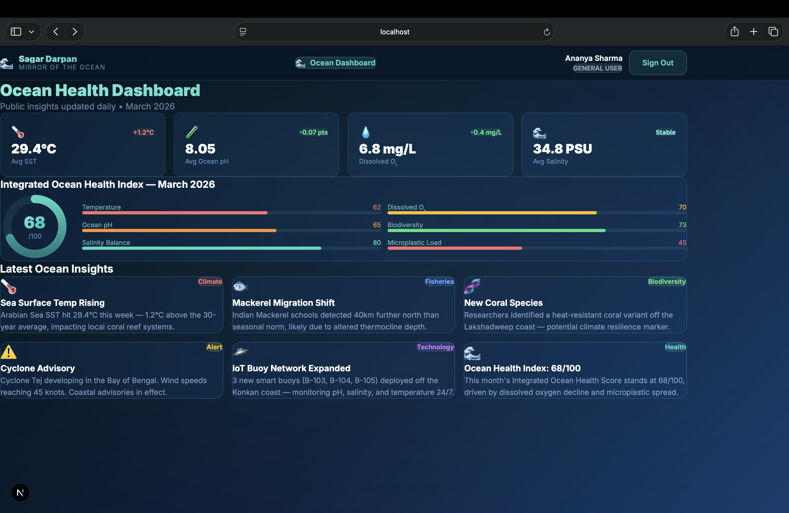
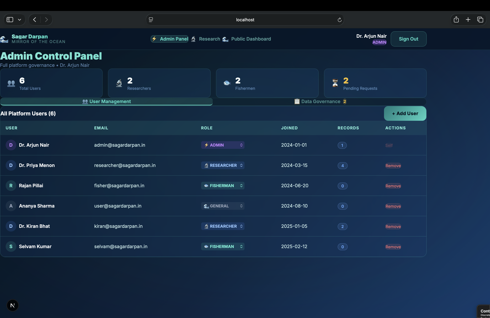
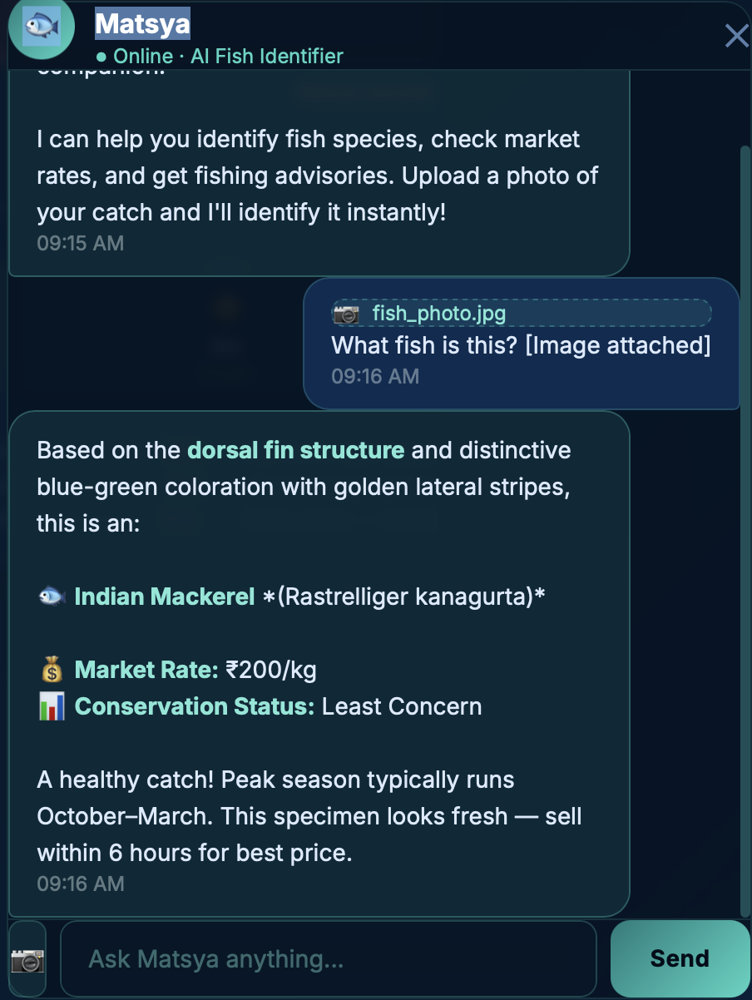
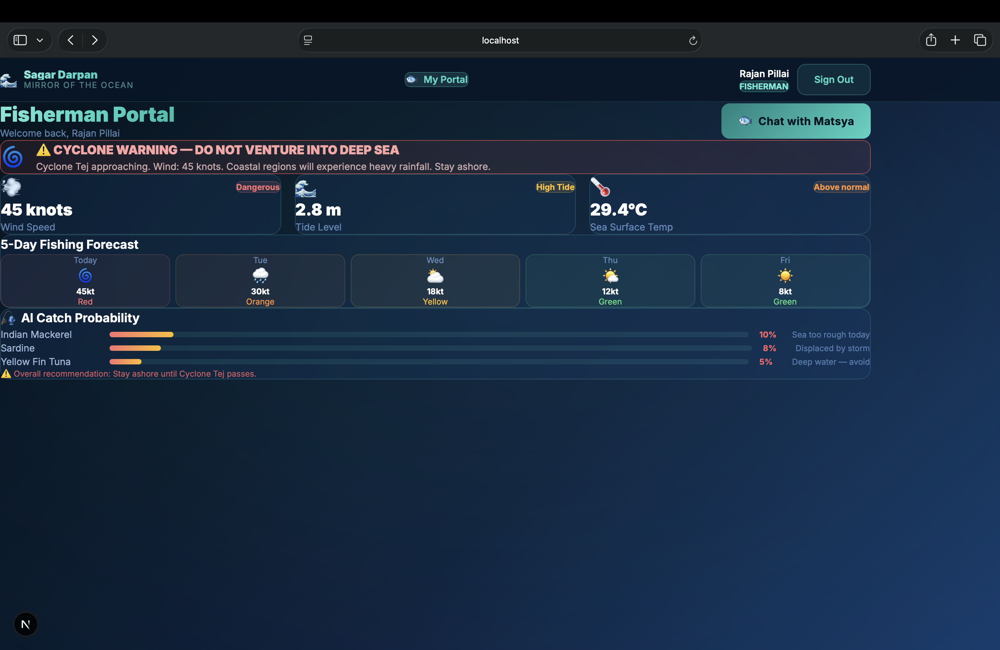
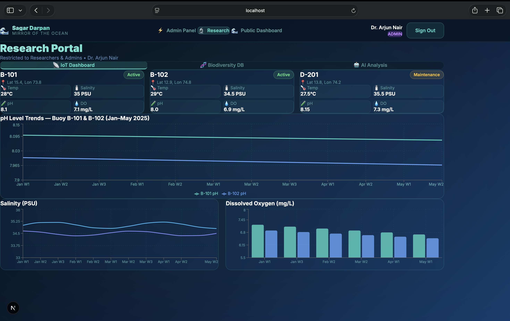

Status: Completed Academic / Hackathon Project
# Sagar Darpan – AI Ocean Intelligence Platform

Sagar Darpan is an AI-powered platform designed to provide insights into oceanography, fisheries, and marine biodiversity.

The system integrates data analytics, machine learning, and visualization tools to help researchers, policymakers, and fishermen better understand marine ecosystems and make data-driven decisions.

This project was developed as part of the Smart India Hackathon.

---

## Project Features

- AI chatbot for fishermen guidance
- Fisheries analytics and prediction
- Marine biodiversity visualization
- Oceanographic data dashboards
- Interactive data insights

---
## 📷 Screenshots

### Dashboard

### Admin Panel

### Chatbot

### Fisherman Module

### Research Module

### Login Page

## Technology Stack

Frontend
- React.js

Backend
- Node.js
- Express.js

Data Processing and AI
- Python
- Machine Learning models

Visualization
- Data visualization libraries (Chart.js / similar tools)

---

## My Contribution

- Full-stack application development
- Backend API design and integration
- AI chatbot integration
- Development of data visualization dashboards

---

## Project Context

This project was developed during the Smart India Hackathon to explore the use of AI and data analytics for marine ecosystem insights.

---

## Repository Structure

frontend/  
backend/  
data/  
screenshots/

---

## Future Improvements

- Improved predictive models for fisheries
- Integration with real-time ocean data APIs
- Advanced analytics dashboards
